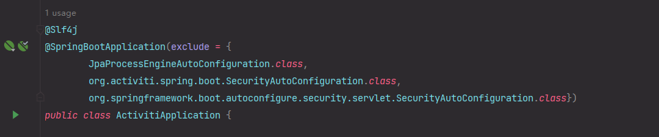

# risk-activiti

#### 介绍
SpringBoot集成Vue3和element-plus实现Activiti模型在线操做
附加功能：LuckySheet实现Excel在线编辑/预览

#### 集成Activiti在线流程设计器

[^其他依赖根据需要自行添加]: 

##### Activiti所需依赖

```xml
<?xml version="1.0" encoding="UTF-8"?>
<project xmlns:xsi="http://www.w3.org/2001/XMLSchema-instance"
         xmlns="http://maven.apache.org/POM/4.0.0"
         xsi:schemaLocation="http://maven.apache.org/POM/4.0.0 http://maven.apache.org/xsd/maven-4.0.0.xsd">
    <modelVersion>4.0.0</modelVersion>

    <groupId>com.xazhao</groupId>
    <artifactId>risk-activiti</artifactId>
    <version>2024.3.1-SNAPSHOT</version>

    <!-- 打包方式 -->
    <packaging>jar</packaging>

    <!-- 继承spring-boot工程 -->
    <parent>
        <groupId>org.springframework.boot</groupId>
        <artifactId>spring-boot-starter-parent</artifactId>
        <version>2.7.12</version>
    </parent>

    <properties>
        <!-- 项目源码及编译输出的编码集 -->
        <project.build.sourceEncoding>UTF-8</project.build.sourceEncoding>
        <project.reporting.outputEncoding>UTF-8</project.reporting.outputEncoding>

        <!-- 项目编译JDK版本 -->
        <maven.compiler.source>8</maven.compiler.source>
        <maven.compiler.target>8</maven.compiler.target>

        <!-- 依赖包版本管理 -->
        <spring-boot.version>2.7.12</spring-boot.version>
        <activiti.version>5.19.0</activiti.version>
        <batik.version>1.7</batik.version>
        <satoken.version>1.34.0</satoken.version>
        <mysql-connector.version>8.0.33</mysql-connector.version>
        <druid.version>1.2.18</druid.version>
        <spring-mybatis.version>2.3.1</spring-mybatis.version>
        <tk-mapper.version>4.2.2</tk-mapper.version>
        <pagehelper.boot.version>1.4.6</pagehelper.boot.version>
        <lombok.version>1.18.8</lombok.version>
        <apache-commons.version>3.12.0</apache-commons.version>
        <hutool-all.version>5.8.18</hutool-all.version>
        <fastjson.version>1.2.8</fastjson.version>
        <persistence.version>1.0</persistence.version>
    </properties>

    <dependencies>
        <!-- Activiti -->
        <dependency>
            <groupId>org.activiti</groupId>
            <artifactId>activiti-spring-boot-starter-basic</artifactId>
            <version>${activiti.version}</version>
        </dependency>

        <dependency>
            <groupId>org.activiti</groupId>
            <artifactId>activiti-json-converter</artifactId>
            <version>${activiti.version}</version>
        </dependency>

        <dependency>
            <groupId>org.activiti</groupId>
            <artifactId>activiti-engine</artifactId>
            <version>${activiti.version}</version>
            <exclusions>
                <exclusion>
                    <groupId>org.mybatis</groupId>
                    <artifactId>mybatis</artifactId>
                </exclusion>
            </exclusions>
        </dependency>

        <!-- Activiti流程图 -->
        <dependency>
            <groupId>org.activiti</groupId>
            <artifactId>activiti-diagram-rest</artifactId>
            <version>${activiti.version}</version>
        </dependency>

        <!-- Activiti在线设计器 -->
        <dependency>
            <groupId>org.activiti</groupId>
            <artifactId>activiti-modeler</artifactId>
            <version>${activiti.version}</version>
        </dependency>

        <!-- batik相关 -->
        <dependency>
            <groupId>org.apache.xmlgraphics</groupId>
            <artifactId>batik-codec</artifactId>
            <version>${batik.version}</version>
        </dependency>

        <dependency>
            <groupId>org.apache.xmlgraphics</groupId>
            <artifactId>batik-css</artifactId>
            <version>${batik.version}</version>
        </dependency>

        <dependency>
            <groupId>org.apache.xmlgraphics</groupId>
            <artifactId>batik-svg-dom</artifactId>
            <version>${batik.version}</version>
        </dependency>

        <dependency>
            <groupId>org.apache.xmlgraphics</groupId>
            <artifactId>batik-svggen</artifactId>
            <version>${batik.version}</version>
        </dependency>

        <!-- 实体类表注解 -->
        <dependency>
            <groupId>javax.persistence</groupId>
            <artifactId>persistence-api</artifactId>
            <version>${persistence.version}</version>
        </dependency>

        <!-- web -->
        <dependency>
            <groupId>org.springframework.boot</groupId>
            <artifactId>spring-boot-starter-web</artifactId>
        </dependency>

        <!-- aop -->
        <dependency>
            <groupId>org.springframework.boot</groupId>
            <artifactId>spring-boot-starter-aop</artifactId>
        </dependency>

        <!-- Test -->
        <dependency>
            <groupId>org.springframework.boot</groupId>
            <artifactId>spring-boot-starter-test</artifactId>
        </dependency>

        <!-- junit -->
        <dependency>
            <groupId>junit</groupId>
            <artifactId>junit</artifactId>
            <scope>test</scope>
        </dependency>

        <!-- Mysql -->
        <dependency>
            <groupId>mysql</groupId>
            <artifactId>mysql-connector-java</artifactId>
            <version>${mysql-connector.version}</version>
            <scope>runtime</scope>
        </dependency>

        <!-- druid -->
        <dependency>
            <groupId>com.alibaba</groupId>
            <artifactId>druid-spring-boot-starter</artifactId>
            <version>${druid.version}</version>
        </dependency>

        <!-- Mybatis -->
        <dependency>
            <groupId>org.mybatis.spring.boot</groupId>
            <artifactId>mybatis-spring-boot-starter</artifactId>
            <version>${spring-mybatis.version}</version>
        </dependency>

        <!-- Mapper -->
        <dependency>
            <groupId>tk.mybatis</groupId>
            <artifactId>mapper</artifactId>
            <version>${tk-mapper.version}</version>
        </dependency>

        <!-- pageHelper -->
        <dependency>
            <groupId>com.github.pagehelper</groupId>
            <artifactId>pagehelper-spring-boot-starter</artifactId>
            <version>${pagehelper.boot.version}</version>
        </dependency>

        <!-- validation -->
        <dependency>
            <groupId>jakarta.validation</groupId>
            <artifactId>jakarta.validation-api</artifactId>
        </dependency>

        <!-- apache-lang3 -->
        <dependency>
            <groupId>org.apache.commons</groupId>
            <artifactId>commons-lang3</artifactId>
            <version>${apache-commons.version}</version>
        </dependency>

        <!-- hutool -->
        <dependency>
            <groupId>cn.hutool</groupId>
            <artifactId>hutool-all</artifactId>
            <version>${hutool-all.version}</version>
        </dependency>

        <!-- Lombok -->
        <dependency>
            <groupId>org.projectlombok</groupId>
            <artifactId>lombok</artifactId>
            <version>${lombok.version}</version>
        </dependency>

        <dependency>
            <groupId>com.alibaba</groupId>
            <artifactId>fastjson</artifactId>
            <version>${fastjson.version}</version>
        </dependency>
    </dependencies>

    <build>
        <!-- 设置构建的 jar 包名 -->
        <finalName>${project.artifactId}</finalName>
        <plugins>
            <!-- 打包 -->
            <plugin>
                <groupId>org.springframework.boot</groupId>
                <artifactId>spring-boot-maven-plugin</artifactId>
                <version>${spring-boot.version}</version>
                <executions>
                    <execution>
                        <goals>
                            <!-- 将引入的 jar 打入其中 -->
                            <goal>repackage</goal>
                        </goals>
                    </execution>
                </executions>
            </plugin>
        </plugins>
    </build>

</project>
```

##### 配置数据库连接等配置文件

```yaml
server:
  port: 49086

spring:
  application:
    name: risk-activiti
  web:
    resources:
      # templates目录下的文件无法直接访问，需要在static-locations中加入templates
      static-locations: classpath:/META-INF/resources/,classpath:/resources/,classpath:/static/,classpath:/public/,classpath:/templates/
  servlet:
    multipart:
      max-file-size: 1024MB
      max-request-size: 1024MB
  datasource:
    name: mysql
    type: com.alibaba.druid.pool.DruidDataSource
    druid:
      url: jdbc:mysql://127.0.0.1:3306/risk_activiti?useUnicode=true&characterEncoding=UTF-8&zeroDateTimeBehavior=convertToNull&useSSL=true&serverTimezone=GMT%2B8&allowMultiQueries=true&autoReconnect=true&keepAlive=true&autoReconnectForPools=true&connectTimeout=30000&socketTimeout=60000&nullCatalogMeansCurrent=true
      username: root
      password: xaroot
      driver-class-name: com.mysql.cj.jdbc.Driver
      initial-size: 20
      min-idle: 20
      max-active: 100
      max-wait: 60000
      time-between-eviction-runs-millis: 60000
      min-evictable-idle-time-millis: 300000
      validation-query: SELECT 1 FROM DUAL
      test-while-idle: true
      test-on-borrow: false
      test-on-return: false

mybatis:
  type-aliases-package: com.xazhao.entity, com.xazhao.dto
  mapper-locations: classpath*:mappers/**/*Mapper.xml
  # 加载全局配置
  configuration:
    cache-enabled: true
    use-generated-keys: true
    default-executor-type: reuse
    log-impl: org.apache.ibatis.logging.stdout.StdOutImpl
    map-underscore-to-camel-case: true

```

##### 排除安全校验

启动类排除ActivitiDesignApplication安全校验



##### 下载源码

```html
下载官网源码包：https://github.com/Activiti/Activiti/tree/activiti-5.19.0
```

选择Activiti对应版本，下载源码


##### 转移静态资源

```java
在SpringBoot项目resources文件夹中创建static、templates文件夹

将resources文件夹stencilset.json的json文件复制到自己xiang'm的resources文件夹中

进入..\Activiti-activiti-5.19.0\modules\activiti-webapp-explorer2\src\main\webapp文件夹

将diagram-viewer、editor-app、favicon.ico文件夹拷贝至SpringBoot项目中\src\main\resources\static文件夹
将modeler.html拷贝至SpringBoot项目中\src\main\resources\templates文件夹

/** 
注：
    editor-app是编辑器、modeler.html是编辑器的入口页面
    diagram-viewer是流程跟踪插件
    界面组件：stencilset.json本身是英文的，可以通过替换来实现汉化的效果
```


##### 设计器后端部分

```java
提取Activiti-activiti-5.19.0项目中
    StencilsetRestResource.java(模具集Rest资源)
    ModelEditorJsonRestResource.java(模板编辑)
    ModelSaveRestResource.java (模型保存)
```

###### StencilsetRestResource.java

```java
/* Licensed under the Apache License, Version 2.0 (the "License");
 * you may not use this file except in compliance with the License.
 * You may obtain a copy of the License at
 *
 *      http://www.apache.org/licenses/LICENSE-2.0
 *
 * Unless required by applicable law or agreed to in writing, software
 * distributed under the License is distributed on an "AS IS" BASIS,
 * WITHOUT WARRANTIES OR CONDITIONS OF ANY KIND, either express or implied.
 * See the License for the specific language governing permissions and
 * limitations under the License.
 */
package com.xazhao.activiti.controller;

import org.activiti.engine.ActivitiException;
import org.apache.commons.io.IOUtils;
import org.springframework.web.bind.annotation.RequestMapping;
import org.springframework.web.bind.annotation.RequestMethod;
import org.springframework.web.bind.annotation.ResponseBody;
import org.springframework.web.bind.annotation.RestController;

import java.io.InputStream;

/**
 * @ClassName StencilsetRestResource.java
 * @Author XaZhao
 * @Create 2024.04.01
 * @UpdateUser
 * @UpdateDate 2024.04.01
 * @Version 2024.0.1
 * @Description
 */

@RestController
public class StencilsetRestResource {

    @RequestMapping(value = "/editor/stencilset", method = RequestMethod.GET, produces = "application/json;charset=utf-8")
    public @ResponseBody String getStencilset() {
        InputStream stencilsetStream = this.getClass().getClassLoader().getResourceAsStream("activiti/stencilset.json");
        try {
            return IOUtils.toString(stencilsetStream, "utf-8");
        } catch (Exception e) {
            throw new ActivitiException("Error while loading stencil set", e);
        }
    }
}

```

###### ModelEditorJsonRestResource.java

```java
/* Licensed under the Apache License, Version 2.0 (the "License");
 * you may not use this file except in compliance with the License.
 * You may obtain a copy of the License at
 *
 *      http://www.apache.org/licenses/LICENSE-2.0
 *
 * Unless required by applicable law or agreed to in writing, software
 * distributed under the License is distributed on an "AS IS" BASIS,
 * WITHOUT WARRANTIES OR CONDITIONS OF ANY KIND, either express or implied.
 * See the License for the specific language governing permissions and
 * limitations under the License.
 */
package com.xazhao.activiti.controller;

import com.fasterxml.jackson.databind.ObjectMapper;
import com.fasterxml.jackson.databind.node.ObjectNode;
import lombok.extern.slf4j.Slf4j;
import org.activiti.editor.constants.ModelDataJsonConstants;
import org.activiti.engine.ActivitiException;
import org.activiti.engine.RepositoryService;
import org.activiti.engine.repository.Model;
import org.apache.commons.lang3.StringUtils;
import org.springframework.web.bind.annotation.PathVariable;
import org.springframework.web.bind.annotation.RequestMapping;
import org.springframework.web.bind.annotation.RequestMethod;
import org.springframework.web.bind.annotation.RestController;

import javax.annotation.Resource;

/**
 * @ClassName ModelEditorJsonRestResource.java
 * @Author XaZhao
 * @Create 2024.04.01
 * @UpdateUser
 * @UpdateDate 2024.04.01
 * @Version 2024.0.1
 * @Description
 */

@Slf4j
@RestController
public class ModelEditorJsonRestResource implements ModelDataJsonConstants {

    @Resource
    private RepositoryService repositoryService;

    @Resource
    private ObjectMapper objectMapper;

    @RequestMapping(value = "/model/{modelId}/json", method = RequestMethod.GET, produces = "application/json")
    public ObjectNode getEditorJson(@PathVariable String modelId) {
        ObjectNode modelNode = null;

        Model model = repositoryService.getModel(modelId);

        if (model != null) {
            try {
                if (StringUtils.isNotEmpty(model.getMetaInfo())) {
                    modelNode = (ObjectNode) objectMapper.readTree(model.getMetaInfo());
                } else {
                    modelNode = objectMapper.createObjectNode();
                    modelNode.put(MODEL_NAME, model.getName());
                }
                modelNode.put(MODEL_ID, model.getId());
                ObjectNode editorJsonNode = (ObjectNode) objectMapper.readTree(
                        new String(repositoryService.getModelEditorSource(model.getId()), "utf-8"));
                modelNode.put("model", editorJsonNode);

            } catch (Exception e) {
                log.error("Error creating model JSON", e);
                throw new ActivitiException("Error creating model JSON", e);
            }
        }
        return modelNode;
    }
}
```

###### ModelSaveRestResource.java

```java
/* Licensed under the Apache License, Version 2.0 (the "License");
 * you may not use this file except in compliance with the License.
 * You may obtain a copy of the License at
 *
 *      http://www.apache.org/licenses/LICENSE-2.0
 *
 * Unless required by applicable law or agreed to in writing, software
 * distributed under the License is distributed on an "AS IS" BASIS,
 * WITHOUT WARRANTIES OR CONDITIONS OF ANY KIND, either express or implied.
 * See the License for the specific language governing permissions and
 * limitations under the License.
 */
package com.xazhao.activiti.controller;

import com.fasterxml.jackson.databind.ObjectMapper;
import com.fasterxml.jackson.databind.node.ObjectNode;
import com.xazhao.constant.Activiti;
import lombok.extern.slf4j.Slf4j;
import org.activiti.editor.constants.ModelDataJsonConstants;
import org.activiti.engine.ActivitiException;
import org.activiti.engine.RepositoryService;
import org.activiti.engine.repository.Model;
import org.apache.batik.transcoder.TranscoderInput;
import org.apache.batik.transcoder.TranscoderOutput;
import org.apache.batik.transcoder.image.PNGTranscoder;
import org.apache.commons.lang3.StringUtils;
import org.springframework.http.HttpStatus;
import org.springframework.util.MultiValueMap;
import org.springframework.web.bind.annotation.*;

import javax.annotation.Resource;
import javax.servlet.http.HttpServletRequest;
import javax.servlet.http.HttpServletResponse;
import java.io.ByteArrayInputStream;
import java.io.ByteArrayOutputStream;
import java.io.InputStream;
import java.nio.charset.StandardCharsets;


/**
 * @ClassName ModelSaveRestResource.java
 * @Author XaZhao
 * @Create 2024.04.01
 * @UpdateUser
 * @UpdateDate 2024.04.01
 * @Version 2024.0.1
 * @Description
 */

@Slf4j
@RestController
public class ModelSaveRestResource implements ModelDataJsonConstants {

    private final static String NODE_ID = "id";

    private final static String RESOURCE_ID = "resourceId";

    private final static String NODE_NAMESPACE = "namespace";

    private final static String STENCILSET = "stencilset";

    private final static String MODEL_ID = "modelId";

    private final static String REDIRECT_PATH = "/modeler.html?modelId=";

    @Resource
    private RepositoryService repositoryService;

    @Resource
    private ObjectMapper objectMapper;

    /**
     * 设计模型，打开Activiti流程设计器
     *
     * @param request
     * @param response
     */
    @GetMapping("/model/createModel")
    public void designBpmnModel(HttpServletRequest request, HttpServletResponse response) {
        try {
            ObjectMapper objectMapper = new ObjectMapper();
            ObjectNode editorNode = objectMapper.createObjectNode();
            editorNode.put(NODE_ID, "canvas");
            editorNode.put(RESOURCE_ID, "canvas");
            ObjectNode stencilSetNode = objectMapper.createObjectNode();
            stencilSetNode.put(NODE_NAMESPACE, Activiti.NAMESPACE);
            editorNode.put(STENCILSET, stencilSetNode);
            Model bpmnModel = repositoryService.newModel();

            ObjectNode modelObjectNode = objectMapper.createObjectNode();
            modelObjectNode.put(MODEL_NAME, "name");
            modelObjectNode.put(ModelDataJsonConstants.MODEL_REVISION, 1);
            modelObjectNode.put(MODEL_DESCRIPTION, "DESCRIPTION");
            bpmnModel.setMetaInfo(modelObjectNode.toString());
            bpmnModel.setName("name");
            bpmnModel.setKey(StringUtils.defaultString("name"));

            repositoryService.saveModel(bpmnModel);
            repositoryService.addModelEditorSource(bpmnModel.getId(), editorNode.toString().getBytes(StandardCharsets.UTF_8));

            request.setAttribute(MODEL_ID, bpmnModel.getId());

            response.sendRedirect(request.getContextPath() + REDIRECT_PATH + bpmnModel.getId());
        } catch (Exception e) {
            log.error(e.getMessage(), e);
        }
    }

    @RequestMapping(value = "/model/{modelId}/save", method = RequestMethod.PUT)
    @ResponseStatus(value = HttpStatus.OK)
    public void saveModel(@PathVariable String modelId, @RequestBody MultiValueMap<String, String> values) {
        try {

            Model model = repositoryService.getModel(modelId);

            ObjectNode modelJson = (ObjectNode) objectMapper.readTree(model.getMetaInfo());

            modelJson.put(MODEL_NAME, values.getFirst("name"));
            modelJson.put(MODEL_DESCRIPTION, values.getFirst("description"));
            model.setMetaInfo(modelJson.toString());
            model.setName(values.getFirst("name"));

            repositoryService.saveModel(model);

            repositoryService.addModelEditorSource(model.getId(), values.getFirst("json_xml").getBytes(StandardCharsets.UTF_8));

            InputStream svgStream = new ByteArrayInputStream(values.getFirst("svg_xml").getBytes(StandardCharsets.UTF_8));
            TranscoderInput input = new TranscoderInput(svgStream);

            PNGTranscoder transcoder = new PNGTranscoder();
            // Setup output
            ByteArrayOutputStream outStream = new ByteArrayOutputStream();
            TranscoderOutput output = new TranscoderOutput(outStream);

            // Do the transformation
            transcoder.transcode(input, output);
            final byte[] result = outStream.toByteArray();
            repositoryService.addModelEditorSourceExtra(model.getId(), result);
            outStream.close();

        } catch (Exception e) {
            log.error("Error saving model", e);
            throw new ActivitiException("Error saving model", e);
        }
    }
}

```

###### contextRoot

src/main/resources/static/editor-app/app-cfg.js设置contextRoot

```javascript
/*
 * Activiti Modeler component part of the Activiti project
 * Copyright 2005-2014 Alfresco Software, Ltd. All rights reserved.
 * 
 * This library is free software; you can redistribute it and/or
 * modify it under the terms of the GNU Lesser General Public
 * License as published by the Free Software Foundation; either
 * version 2.1 of the License, or (at your option) any later version.
 *
 * This library is distributed in the hope that it will be useful,
 * but WITHOUT ANY WARRANTY; without even the implied warranty of
 * MERCHANTABILITY or FITNESS FOR A PARTICULAR PURPOSE.  See the GNU
 * Lesser General Public License for more details.

 * You should have received a copy of the GNU Lesser General Public
 * License along with this library; if not, write to the Free Software
 * Foundation, Inc., 51 Franklin Street, Fifth Floor, Boston, MA  02110-1301  USA
 */
'use strict';

var ACTIVITI = ACTIVITI || {};

ACTIVITI.CONFIG = {
	// 'contextRoot' : '/activiti-explorer/service',
	'contextRoot' : '',
};

/**
	若以上三个Java文件中配置了如：@RestController(/bpmn)类路径需要在contextRoot中配置如：'contextRoot' : '/bpmn',
*/

```


```java
/**
完成以上操做启动项目访问
	http://127.0.0.1:49086/model/createModel
```


```java
/**
	汉化，将stencilset.json文件内容替换为以下json文件
```

###### stencilset.json

[^stencilset_en.json汉化json文件]: 

[stencilset.json](../src/main/resources/activiti/stencilset_en.json)


